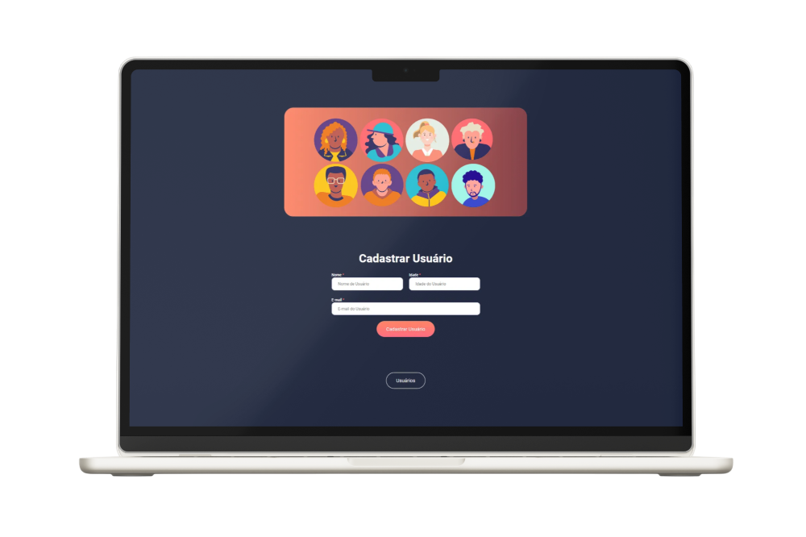

# Easy-Shopping

Este é um projeto onde utilizo pela primeira vez o **React**, criando uma aplicação onde o usuário se cadastra e pode ver os outros usuários já cadastrados.

## 📸 Page-Preview

## 👷🏻‍♀️ Tecnologias Utilizadas

- HTML
- CSS
- React

### 🚀Características

- Celular & Desktop Layouts
- Html Semantico
- Bibliotecas do react

## 👩🏻‍💻 Autor

  
  
